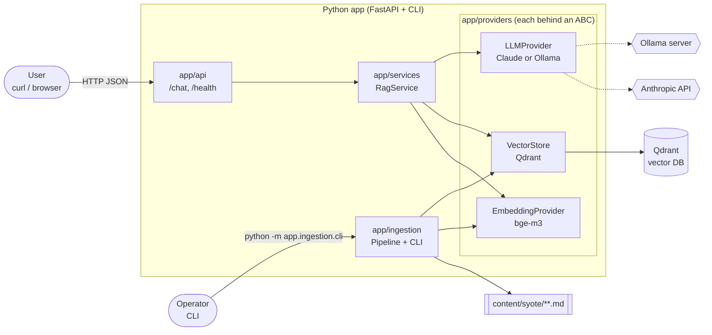
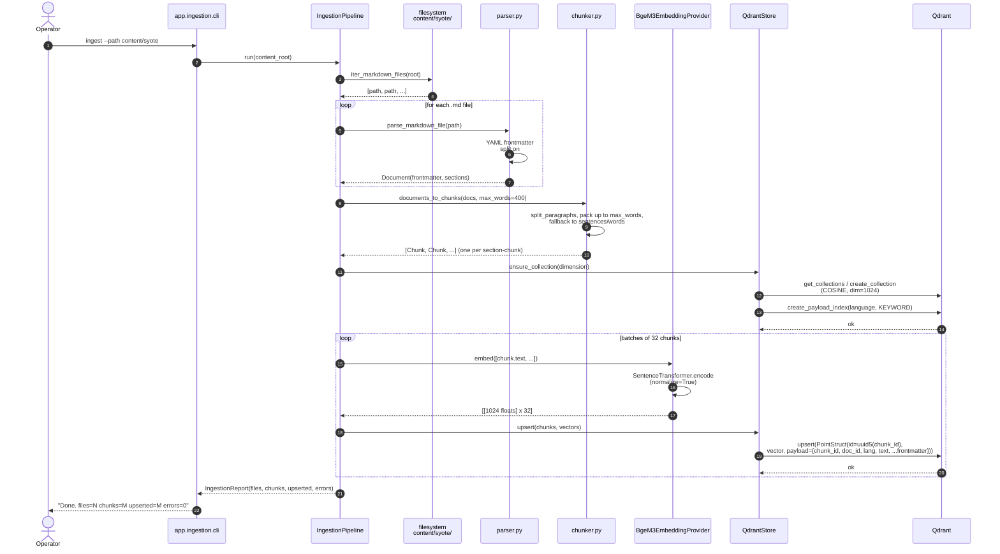
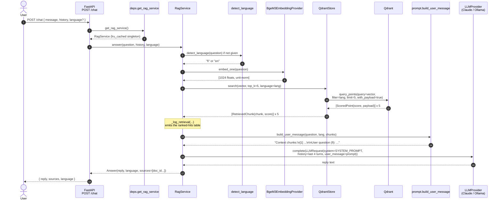

# Architecture

This document explains what every part of the codebase is responsible for
and shows end-to-end how a question travels through the system. It's
written for someone who has skimmed the code and now wants to understand
*why* it's shaped this way and *what happens when you hit /chat*.

Read top to bottom on first encounter. On re-reads, jump straight to the
section you need.

## Contents

1. [High-level view](#1-high-level-view)
2. [Layer responsibilities](#2-layer-responsibilities)
3. [Domain model reference](#3-domain-model-reference)
4. [Sequence: ingestion (vectorization)](#4-sequence-ingestion-vectorization)
5. [Sequence: chat request](#5-sequence-chat-request)
6. [How vectorization actually works](#6-how-vectorization-actually-works)
7. [Prompt composition](#7-prompt-composition)
8. [Extending the system](#8-extending-the-system)
9. [Testing strategy](#9-testing-strategy)

---

## 1. High-level view

Two separate flows share the same providers:

- **Ingestion** (offline, run via CLI) turns markdown files into vectors
  and stores them in Qdrant.
- **Chat** (online, driven by `POST /chat`) embeds a question, finds the
  nearest chunks in Qdrant, and asks an LLM to answer *grounded in those
  chunks*.



The key rule the whole codebase respects: **services never call an SDK
directly**. Everything external (Anthropic, Ollama, Qdrant,
sentence-transformers) sits behind an abstract base class in
`app/providers/`, so swapping an implementation is a one-file change.

---

## 2. Layer responsibilities

Directory-by-directory. File names map 1:1 to the layout.

### `app/domain/`

Pure data, no I/O, no dependencies beyond the standard library and
`typing`. Dataclasses that every other layer passes around.

| File          | Role                                                                 |
|---------------|----------------------------------------------------------------------|
| `models.py`   | `Document`, `Chunk`, `RetrievedChunk`, `ChatTurn`, `Query`, `Answer` |
| `__init__.py` | Re-exports the names so callers can `from app.domain import Chunk`   |

See [§3](#3-domain-model-reference) for field-by-field descriptions.

### `app/config/`

Runtime configuration + logging. One entry point (`get_settings()`), one
logging setup.

| File          | Role                                                                                       |
|---------------|--------------------------------------------------------------------------------------------|
| `settings.py` | `Settings` (pydantic-settings) — loads from env/`.env`. `get_settings()` is lru-cached.    |
| `logging.py`  | `configure_logging(level)` — idempotent root-logger setup.                                 |

Settings you'll touch most often:

- `LLM_PROVIDER` (`claude`/`ollama`), `ANTHROPIC_API_KEY`, `CLAUDE_MODEL`,
  `OLLAMA_URL`, `OLLAMA_MODEL`
- `EMBEDDING_MODEL`, `EMBEDDING_DIM`
- `QDRANT_URL`, `QDRANT_COLLECTION`
- `TOP_K`, `MAX_HISTORY_TURNS`
- `LOG_LEVEL`

### `app/providers/`

Every external integration lives here, always behind an abstract base
class. Three integrations, same pattern: `base.py` defines the ABC,
sibling files provide implementations.

#### `app/providers/llm/`

| File        | Role                                                                            |
|-------------|---------------------------------------------------------------------------------|
| `base.py`   | `LLMProvider` (ABC) + `LLMRequest` dataclass. Stateless: full history per call. |
| `claude.py` | `ClaudeProvider` — `anthropic.Anthropic` client, `messages.create(...)`.        |
| `ollama.py` | `OllamaProvider` — local Ollama via stdlib `urllib`, POST `/api/chat`.          |

Swapping between Claude and Ollama is controlled by the `LLM_PROVIDER`
setting; wiring happens in `app/api/deps.py::_build_llm`.

#### `app/providers/embeddings/`

| File        | Role                                                                              |
|-------------|-----------------------------------------------------------------------------------|
| `base.py`   | `EmbeddingProvider` (ABC). Contract: unit-normalised vectors when `normalize=True`. |
| `bge_m3.py` | `BgeM3EmbeddingProvider` — `sentence-transformers` loading `BAAI/bge-m3` lazily.  |

The model is not loaded at import time — only on first call. This keeps
test imports cheap (~100 ms) vs loading a 2 GB model (~20 s).

#### `app/providers/vectorstore/`

| File        | Role                                                                                         |
|-------------|----------------------------------------------------------------------------------------------|
| `base.py`   | `VectorStore` (ABC): `ensure_collection`, `upsert`, `search` — all the RAG loop needs.       |
| `qdrant.py` | `QdrantStore` — `QdrantClient`. Uses `query_points` (search was removed in qdrant-client 1.17). |

Point IDs in Qdrant must be UUID or uint64. We derive them deterministically
from `chunk_id` via UUIDv5 in a fixed namespace, so re-ingesting updates the
same row instead of creating a duplicate.

### `app/ingestion/`

The offline pipeline that turns markdown into vectors in Qdrant. Run via
CLI once, then again whenever content changes.

| File          | Role                                                                                        |
|---------------|---------------------------------------------------------------------------------------------|
| `parser.py`   | `parse_markdown_file` + `split_language_sections` + `iter_markdown_files`. YAML frontmatter via `python-frontmatter`, regex-split on `## English` / `## Suomi`. |
| `chunker.py`  | `document_to_chunks` + `chunk_section`. Paragraph-boundary chunking, fallback to sentence / word boundaries for pathological paragraphs. |
| `pipeline.py` | `IngestionPipeline.run(content_root)` — walks files, parses, chunks, batches embedding calls, upserts. Returns `IngestionReport`. |
| `cli.py`      | Typer CLI. `python -m app.ingestion.cli ingest --path content/syote`.                       |
| `__main__.py` | Lets you run the module with `python -m app.ingestion.cli`.                                 |

### `app/services/`

Online orchestration — invoked per chat request.

| File          | Role                                                                                               |
|---------------|----------------------------------------------------------------------------------------------------|
| `rag.py`      | `RagService.answer(question, history, language?)`. Coordinates embed → search → prompt → LLM.      |
| `language.py` | `detect_language(text)` — heuristic returning `'fi'` or `'en'`. Cheap; swap for `langdetect` later. |
| `prompt.py`   | `SYSTEM_PROMPT`, `build_user_message(question, language, chunks)`, `format_context(chunks)`.        |

`RagService` also emits the vector-proximity log block (ranked hits with
scores, Δ-vs-top, language, text preview) — see the logging block in
`rag.py::_log_retrieval`.

### `app/api/`

FastAPI surface. Three files, each with one reason to change.

| File         | Role                                                                                                  |
|--------------|-------------------------------------------------------------------------------------------------------|
| `schemas.py` | Pydantic request/response models. `ChatRequest`, `ChatResponse`, `ChatMessage`, `HealthResponse`.     |
| `deps.py`    | `get_rag_service()` — lru-cached factory that builds real providers from settings. `_build_llm` dispatches on `LLM_PROVIDER`. |
| `routes.py`  | `GET /health`, `POST /chat`. Translates between pydantic and domain types.                            |

### `app/main.py`

FastAPI app factory. Configures logging, mounts CORS (permissive for PoC
— see README), registers the router.

### `content/syote/`

Markdown corpus. YAML frontmatter + `## English` / `## Suomi` sections.
The frontmatter fields (`id`, `type`, `category`, prices, `season`,
`tags`, `updated`) end up as Qdrant payload and can be filtered against
later.

---

## 3. Domain model reference

All frozen `@dataclass` definitions in `app/domain/models.py`:

```python
Language = Literal["fi", "en"]

Document(
    doc_id: str,
    source_file: str,
    frontmatter: dict[str, Any],
    sections: dict[Language, str],   # split body, "en"/"fi" -> text
)

Chunk(
    chunk_id: str,                   # "{doc_id}__{lang}__{idx}"
    doc_id: str,
    language: Language,
    text: str,
    metadata: dict[str, Any],        # frontmatter + source_file
)

RetrievedChunk(
    chunk: Chunk,
    score: float,                    # cosine similarity from Qdrant
)

ChatTurn(
    role: Literal["user", "assistant"],
    content: str,
)

Query(                               # wrapper used in a few internal paths
    text: str,
    language: Language,
    history: list[ChatTurn],
)

Answer(                              # return type of RagService.answer
    reply: str,
    language: Language,
    sources: list[str],              # doc_ids of the chunks used
)
```

Rule of thumb: anything crossing a layer boundary uses one of these
types. Pydantic models exist only at the HTTP edge (`app/api/schemas.py`)
and are converted to domain types in `routes.py`.

---

## 4. Sequence: ingestion (vectorization)

This runs once on startup and again whenever `content/` changes. It's the
only path that writes to Qdrant.



Key properties:

- **Idempotent.** Chunk IDs are derived deterministically from
  `{doc_id}__{lang}__{idx}`, UUIDv5-hashed for Qdrant. Re-running updates
  existing points instead of duplicating.
- **Batched embedding.** 32 at a time is the sweet spot for CPU inference
  of bge-m3.
- **Payload index on `language`.** Added once at collection creation;
  lets the query-time language filter run in O(log n) instead of scanning.
- **Dimension drift is a hard reset.** If `EMBEDDING_DIM` changes,
  `ensure_collection` drops the whole collection and recreates it. Old
  vectors are incompatible with a new model; half-and-half would produce
  garbage.

---

## 5. Sequence: chat request

One HTTP request, one RAG cycle.



Notes:

- `get_rag_service()` is `@lru_cache(maxsize=1)`, so the embedding model
  loads exactly once per process — first `/chat` call after boot has an
  extra 20 s cold start.
- History is trimmed to the last `MAX_HISTORY_TURNS * 2` messages before
  sending to the LLM (default 4 turns = 8 messages).
- The language filter on retrieval is aggressive: if the question is
  Finnish, we search only Finnish chunks. A question in one language
  still gets answered in that language — see [§7](#7-prompt-composition).

---

## 6. How vectorization actually works

A practical tour, no math prerequisites.

### What is an embedding?

An **embedding** is a fixed-length vector of floats — for bge-m3,
1024 of them — that represents the *meaning* of a piece of text.
Two texts that mean similar things end up at vectors that point in
similar directions in 1024-dimensional space.

There's nothing magic about 1024; it's just the number the model was
trained to output. Smaller (384, 768) and larger (4096) models exist.
More dimensions ≠ automatically better.

### Why cosine similarity?

Because we care about **direction**, not magnitude. Two articles about
husky safaris are "about the same thing" regardless of one being twice
as long as the other. Cosine similarity strips length out:

$$
\text{cos}(\theta) = \frac{u \cdot v}{\|u\|\,\|v\|}
$$

Range: −1 (opposite) → 0 (unrelated) → +1 (identical). For
normalised vectors (‖u‖ = ‖v‖ = 1) it collapses to just `u · v`, a single
dot-product. This is why the log line says
`query_vector: dim=1024 L2_norm=1.0000`: bge-m3 returns unit-norm
vectors by default, so "cosine similarity" is really a dot product
under the hood.

### Why chunk?

An embedding compresses "what this text is about" into one vector. Feed
a 20-page document in and you get one vector that averages *everything*.
Now a question about "husky safari prices" lands equally close to every
document that mentions huskies *or* prices — retrieval quality
collapses.

Chunking (paragraph-sized, ≤400 words here) keeps each embedding
focused: one vector per specific topic. Retrieval can then pick *just*
the relevant chunks.

### Why bge-m3?

- **Multilingual.** Trained on 100+ languages, handles Finnish and
  English in the same vector space. A Finnish question can match an
  English chunk if needed (we don't do that here — we filter by
  language — but the capability exists).
- **Open weights.** Runs locally, no API calls, no per-query cost.
- **Strong benchmark scores** relative to parameter count.

### How does Qdrant find the nearest neighbours?

Naively you'd compare the query vector against every stored vector —
that's O(n) per query. Qdrant builds an **HNSW** (Hierarchical Navigable
Small World) index at upsert time: a graph where each vector is a node
and edges connect it to close neighbours at several zoom levels.

A search hops through the graph greedily — start high, descend through
denser layers, stop when you've converged on the local minimum. You
visit maybe 100 vectors to find the top 5, regardless of collection
size. The result is *approximate* nearest neighbours; for RAG that's
fine, because "exact 5th nearest" vs "close enough to 5th nearest" is
not a meaningful distinction for an LLM reading the context.

### What about the `Δ-vs-top` column in the logs?

Rank 1's score is the best match; every other rank shows how much it
dropped off. A sharp cliff (e.g. `−0.22` between rank 1 and 2) means
"there is a clear winner, retrieval is confident". A flat curve (all
within `±0.05`) means "the query was ambiguous or the corpus doesn't
cover it well" — worth flagging because the LLM may mix facts from
multiple adjacent topics.

---

## 7. Prompt composition

Defined in `app/services/prompt.py`. The full prompt the LLM sees has
three components.

### 1. System prompt

The behavioural contract, constant across requests:

> You are a helpful assistant for a Finnish resort and national park
> (Syöte, Pudasjärvi region). **Answer ONLY from the provided context
> chunks.** Do not invent prices, times, phone numbers, or availability.
> If the context does not contain the answer, say so clearly and suggest
> contacting the reception. **Reply in the user's language**: Finnish if
> the question is in Finnish, English if the question is in English.

### 2. Conversation history

Last `MAX_HISTORY_TURNS × 2` messages (default = 8 messages = 4 turns).
Older history is dropped to keep the context window predictable and the
cost bounded.

### 3. User message (assembled from context + question)

```
Context chunks:
[1] source=husky-safari-2h lang=fi score=0.847
Kahden tunnin huskysafari vie sinut syvälle Iso-Syötteen...

---

[2] source=snowshoe-hike lang=fi score=0.621
Opastettu lumikenkävaellus Syötteen kansallispuistoon...

---

[N] ...

Käyttäjän kysymys (fi): Paljonko husky safari maksaa?
```

The `source=...` labels and score numbers are visible to the LLM. We
chose to include them because (a) they let the model weigh relative
confidence, and (b) it helps the caller audit *which* chunk was quoted.

---

## 8. Extending the system

### Add a new LLM provider

1. Create `app/providers/llm/<name>.py`.
2. Subclass `LLMProvider`, implement `complete(request: LLMRequest) -> str`.
3. Export the class from `app/providers/llm/__init__.py`.
4. Add settings fields to `app/config/settings.py` (URL, model, API key…).
5. Extend `_build_llm` in `app/api/deps.py` to dispatch on
   `LLM_PROVIDER`.
6. Add a unit test under `tests/` — mock the transport the same way
   `test_ollama_provider.py` does.

### Add a new embedding provider

Same pattern against `EmbeddingProvider`. Remember to update
`EMBEDDING_DIM` — the next ingestion run will detect the mismatch and
recreate the Qdrant collection automatically.

### Add a new vector store

Same pattern against `VectorStore`. The ABC is deliberately minimal
(`ensure_collection`, `upsert`, `search`) — any RAG-shaped store will
implement those three methods cleanly.

---

## 9. Testing strategy

Run with `make test` (24 tests, ~6 s, no network).

| File                        | What it covers                                                                     |
|-----------------------------|------------------------------------------------------------------------------------|
| `tests/test_parser.py`      | Frontmatter parsing, language-section splitting, fallback to filename stem.        |
| `tests/test_chunker.py`     | Paragraph packing, long-paragraph fallback, deterministic chunk IDs + metadata.    |
| `tests/test_language.py`    | Heuristic language detection for Finnish and English queries.                      |
| `tests/test_rag_flow.py`    | End-to-end RAG flow with fake embeddings/store/LLM; also pins the retrieval log format. |
| `tests/test_ollama_provider.py` | Ollama HTTP contract: URL, method, headers, body shape, response parsing, error wrapping via mocked `urllib.request.urlopen`. |

No integration tests against a real Qdrant or a real LLM — those belong
outside CI. The `VectorStore`/`LLMProvider`/`EmbeddingProvider`
abstractions exist precisely so every service can be unit-tested with
drop-in fakes.

The logged retrieval block is deliberately pinned by a test
(`test_rag_emits_retrieval_log_with_scores_and_doc_ids`) because it's
the primary human-readable diagnostic — if someone accidentally drops
the score column, CI will catch it.
